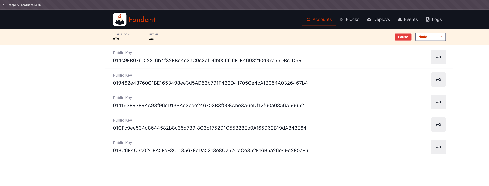

## Integrating Odra and Fondant: Bridging the Gap for Casper Smart Contract Development & Testing

Odra is the recommended framework for building smart contracts on the Casper Network. Fondant, a new and exciting tool, simplifies running a local Casper network and testing contracts with its intuitive UI. As both tools evolve, we can expect closer integration in the future.

This guide will demonstrate how to combine Odra and Fondant today. We'll create a simple Odra contract, deploy it and test it on a local network using livenet. We'll also provide a script to fetch secret keys from Fondant for seamless interaction.

### 1. Creating an Odra Contract

Let's start by creating a new Odra project using the following command:

```bash
cargo odra new --name fondant_x_odra
```

You should see a confirmation message:

```
💁  INFO : Generating a new project...
💁  INFO : Done!
```

Navigate into the project directory and build the contract to ensure everything works as expected:

```bash
cd fondant_x_odra
cargo odra build
```

You'll see a lot of output, but look for a line similar to this:

```
💁  INFO : Saving .../fondant_x_odra/wasm/Flipper.wasm
```

This indicates successful compilation of your contract.

### 2. Installing Fondant

If you don't have Fondant installed yet, clone the repository:
(Docker is required)

```bash
git clone https://github.com/block-bites/fondant-app
```

Change to the `fondant-app` directory and run:

```bash
docker-compose up --build
```

This will build and start Fondant in a Docker container, accessible at `http://localhost:3000`.

Open your browser and navigate to `http://localhost:3000`. Click "Start" in the top-right corner, and you'll see the 5 accounts Fondant has generated:

 

  

### 3. Setting Up the Odra Livenet

Create a file named `livenet.rs` in the `bin` directory of your project. Here's the content:

```rust
use fondant_x_odra::flipper::FlipperHostRef;
use odra::args::Maybe;
use odra::casper_types::U256;
use odra::host::{Deployer, HostEnv, HostRef, HostRefLoader, NoArgs};
use odra::Address;
use std::str::FromStr;

fn main() {
    let env = odra_casper_livenet_env::env();

    // Deploy new contract.
    let mut flipper = deploy_contract(&env);
    println!("flipper current value: {}", flipper.get().to_string());

    // Uncomment to load existing contract.
    // let mut token = load_contract(&env, CASPER_CONTRACT_ADDRESS);
    // println!("Token name: {}", token.get_collection_name());

    env.set_gas(3_000_000_000u64);
    let owner = env.caller();
    let _ = flipper.flip();
    println!("flipper after flip value: {}", flipper.get().to_string());
}

pub fn load_contract(env: &HostEnv, address: &str) -> FlipperHostRef {
    let address = Address::from_str(address).expect("Should be a valid contract address");
    FlipperHostRef::load(env, address)
}

pub fn deploy_contract(env: &HostEnv) -> FlipperHostRef {
    env.set_gas(400_000_000_000u64);
    FlipperHostRef::deploy(env, NoArgs)
}

```

Next, modify your `Cargo.toml` file:

```toml
[dependencies]
odra-casper-livenet-env = { version = "1.0.0", optional = true }
# ... (rest of your dependencies)

[features]
default = []
livenet = ["odra-casper-livenet-env"]

[[bin]]
name = "livenet"
path = "bin/livenet.rs"
required-features = ["livenet"]
test = false
```

Create a `.env` file in your project's root directory with the following content:

```bash
# Path to the secret key of the account that will be used
# to deploy the contracts.
# We're using .keys folder so we don't accidentally commit
# the secret key to the repository.
ODRA_CASPER_LIVENET_SECRET_KEY_PATH=.keys/secret_key_1.pem

# RPC address of the node that will be used to deploy the contracts.
ODRA_CASPER_LIVENET_NODE_ADDRESS=http://localhost/node-1

# Chain name of the network. Known values:
# - integration-test
ODRA_CASPER_LIVENET_CHAIN_NAME=cspr-dev-cctl

# Paths to the secret keys of the additional accounts.
# Main secret key will be 0th account.
ODRA_CASPER_LIVENET_KEY_1=.keys/secret_key_2.pem
ODRA_CASPER_LIVENET_KEY_2=.keys/secret_key_3.pem
ODRA_CASPER_LIVENET_KEY_1=.keys/secret_key_4.pem
ODRA_CASPER_LIVENET_KEY_2=.keys/secret_key_5.pem
```

### 4. Fetching Secret Keys from Fondant

To obtain the secret keys from your Fondant network, create another file named `fetch_keys.rs` in the `bin` directory:

```rust
use reqwest::blocking::Client; // Use blocking client for simplicity
use serde_json::Value;
use std::fs::{create_dir_all, File};
use std::io::Write;
use std::path::Path;

fn main() -> Result<(), Box<dyn std::error::Error>> {
    let base_url = "http://localhost:3000";
    let start_id = 1;
    let end_id = 5;

    let client = Client::new();
    let key_dir = Path::new(".keys");
    create_dir_all(key_dir)?;

    for id in start_id..=end_id {
        let url = format!("{}/users/{}/private_key", base_url, id);
        let filename = key_dir.join(format!("secret_key_{}.pem", id));

        // Fetch the JSON data
        let response = client.get(&url).send()?;
        let json_response: Value = response.json()?;

        // Extract and save the private key
        if let Some(message) = json_response.get("message").and_then(|v| v.as_str()) {
            let mut file = File::create(&filename)?; // Borrow filename with &
            file.write_all(message.as_bytes())?;
            println!("Saved key {} to {}", id, filename.display());
        } else {
            eprintln!("Error: Private key not found in response for {}", url);
        }
    }

    Ok(())
}
```

Update your `Cargo.toml` with the `fetch_keys` binary and dependencies:

```toml
[[bin]]
name = "fetch_keys"
path = "bin/fetch_keys.rs"
test = false

[dependencies]
reqwest = { version = "0.12.4", features = ["json", "blocking"] }
serde_json = "1.0.117"
```

Now, run the following command to fetch and save the secret keys:

```bash
cargo run --bin fetch_keys
```


### 5. Testing with Odra Livenet

With the keys fetched, you can now run your `livenet.rs` script, which will deploy and test your contract on the local Fondant network:

```bash
cargo run --bin livenet --features=livenet
```

Observe the contract deployment and interaction within the Fondant UI!


### Summary

While Odra and Fondant have a natural synergy, there are currently some steps required to make them work together smoothly. This guide aims to bridge that gap and provide a practical way to combine the strengths of both tools. As both projects mature, we can anticipate a more streamlined integration.